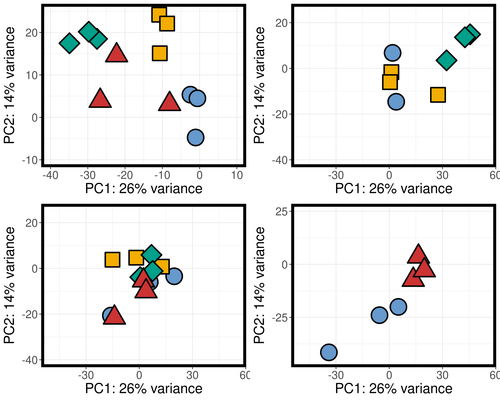
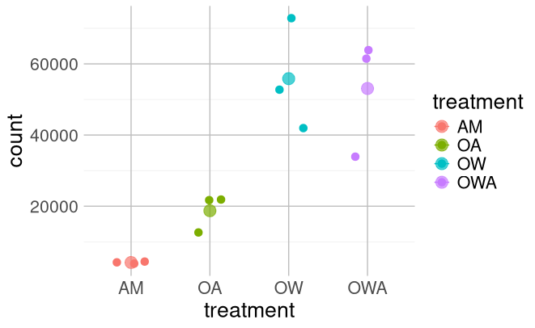
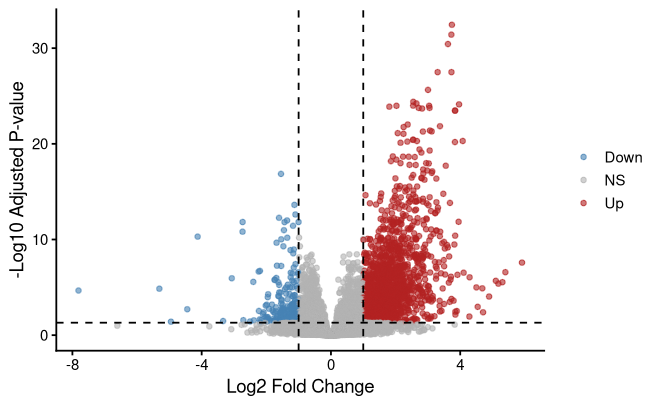
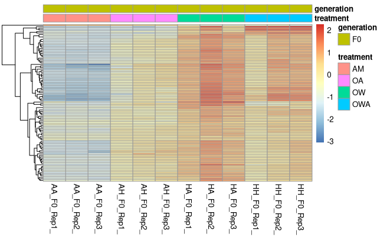
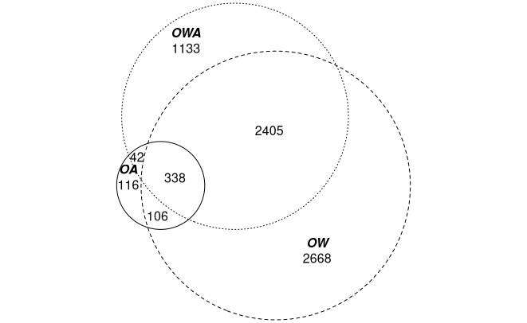
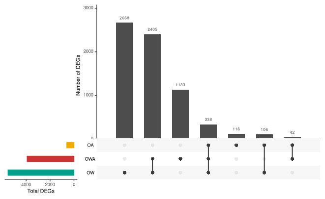

# Intro to Ecological Genomics 2026

### Author: Stephanie Iwinski

### 9/8/26

### Introduction to Notetaking

#### notess

### 9/17/26

### Data intro

### accesing our data in a z file

#### commands I used on the VACC

`cd /gpfs1/cl/biol3990`

`pwd`

`ll`

`ls`

`cd Transcriptomics/`

`ll`

`cd Cleandata/`

`ll`

`zcat AA_F0_Rep3_2_clean.fq.gz  | head -n 8`

`zcat AA_F0_Rep3_2_clean.fq.gz  | head -n 4`

### word count `zcat AA_F0_Rep3_2_clean.fq.gz  | wc -l`

### wc: 93638040

## 9/15/2026 - Setting up lab notebook and learning markdown

-   setting up transcriptomics notebook

-   learn how to take notes in markdown

-   push notes to github

**Working Directory:**

`/gpfs1/home/s/i/siwinski/projects/eco_genomics_2026/transcriptomics`

**Input files:**

`none`

**Output files:**

`/gpfs1/home/s/i/siwinski/projects/eco_genomics_2026/transcriptomics/transcriptomics_notebook.md`

**Programs and Dependencies:**

-   `R version 4.5.1`

-   `R-studio`

**Scripts:**

`none`

**Code:**

``` r
print ("Hello World") 
```

**Table:**

| Col1 | Col2 | Col3 |
|------|------|------|
|      |      |      |
|      |      |      |
|      |      |      |

**Image:**


**Notes/Observations:**

-   oh cool graph! it makes sense! and some interpretation of your data

------------------------------------------------------------------------

## 9/15/2026 - Setting up lab notebook and learning markdown

-   setting up transcriptomics notebook

-   learn how to take notes in markdown

-   push notes to github

**Working Directory:**

`/gpfs1/home/s/i/siwinski/projects/eco_genomics_2026/transcriptomics`

**Input files:**

`none`

**Output files:**

`/gpfs1/home/s/i/siwinski/projects/eco_genomics_2026/transcriptomics/transcriptomics_notebook.md`

**Programs and Dependencies:**

-   `R version 4.5.1`

-   `R-studio`

**Scripts:**

`none`

**Code:**

``` r
print ("Hello World") 
```

**Table:**

## 9/22/2026 - Day 3 of transcriptomics

Today we set up our R working environment and copied the data to import
into DESeq2.

\*\*\*Notes on what we did with all of the code

important line of code for adding the counts matrix to my files

`cp /gpfs1/cl/biol3990/Transcriptomics/CountsMatrix/\* .`

Worked on a R script for looking at the A hudsonica data set

**Scripts:** `ahud_DESeq_inclass.R`

**Graph:**



## 9/24/2026 - Day 4 of transcriptomics

Today we worked in R and learned about paths and directories,
deciphering where things are

**Regularly used Bash code**

pwd = print working directory, PATH, where am I?

cd = change directory

zcat = print out file

head - give just the top of the file

.. = moves back directory

. = from where I am

ls = list, whats here?

ll = long list, whats here?

Worked on a new R script for general understanding

**Output file:**
`/gpfs1/home/s/i/siwinski/projects/eco_genomics_2026/transcriptomics/LearningInR.R`

**New R codes**

using four \#### after a line of text will make a header/bookmark

Gives you results from statistical tests: `resultsNames(dds)`

## 9/29/2026 - Day 4 of transcriptomics

Today we worked in R and visualized the counts matrix, understanding
visualizations

Remember to set working directory before doing anything! notes: in the
file explorer, when you are in the folder you want to be in, you can hit
more on the top and select set working directory. don't forget the
quotations

**My path:**

`setwd("~/projects/eco_genomics_2026/transcriptomics/mydata")`

use a rounded counts tables because DESeq does not like decimals and
requires whole numbers

just running the treatment through this analysis

**R script created:**

`~/projects/eco_genomics_2026/transcriptomics/myscripts/9.29.26_AHUD_DESEQpt2.R`

**Images and Plots Created:**

{width="391"}

Plotting an individual gene, highest count value, in the four different
treatments

{width="467"}

There is a lot more up regulation then down regulation. looking at
statistical analysis and p-value significance.

{width="456"}

graphed heat map of the top differentially expressed genes. Top 100
genes.

{width="402"}

Euler plot (like a Venn diagram but better). Scales the size of the
circles to the size of what is contained within them.

{width="405"}

Upset plot

A new bit of code! `%in%` This asks, “is this member of that group?”
