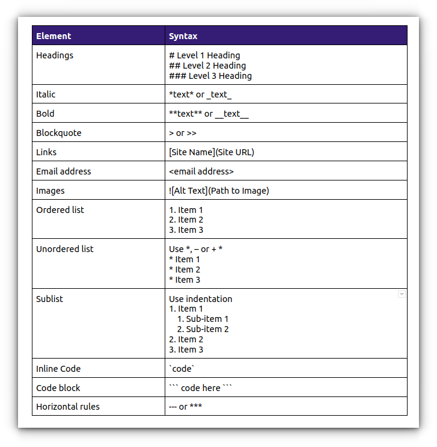
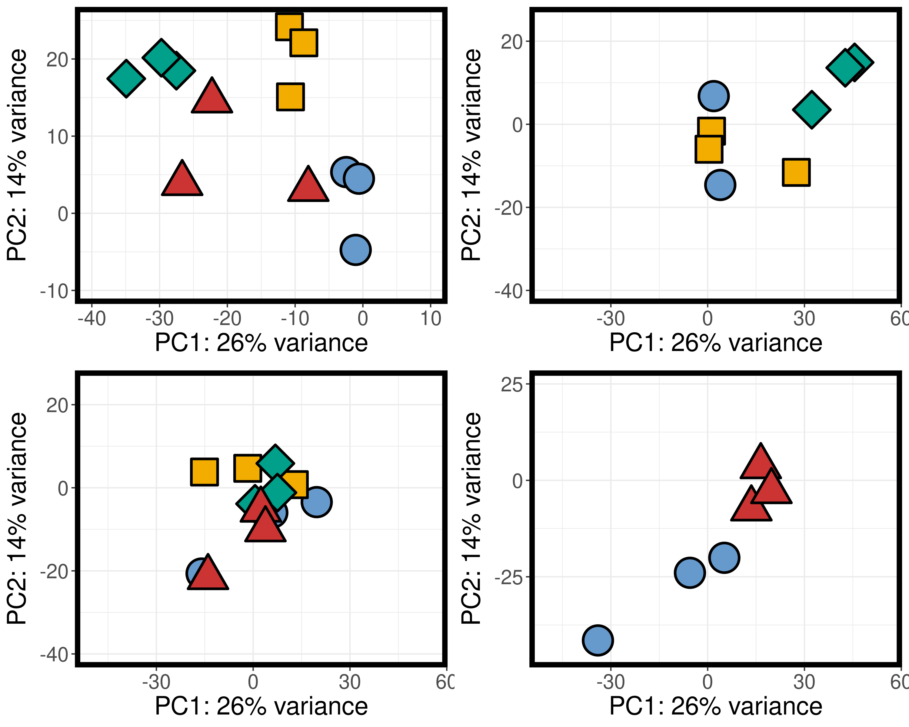

# Transcriptomics Notebook

**Course:** Intro to Ecological Genomics - Fall 2026

**Name:** Stephanie Iwinski

------------------------------------------------------------------------

## 9/15/2026 - Setting up lab notebook and learning markdown

-   setting up transcriptomics notebook

-   learn how to take notes in markdown

-   push notes to github

**Working Directory:**

`/gpfs1/home/s/i/siwinski/projects/eco_genomics_2026/transcriptomics`

**Input files:**

`none`

**Output files:**

`/gpfs1/home/s/i/siwinski/projects/eco_genomics_2026/transcriptomics/transcriptomics_notebook.md`

**Programs and Dependencies:**

-   `R version 4.5.1`

-   `R-studio`

**Scripts:**

`none`

**Code:**

``` r
print ("Hello World") 
```

**Table:**

| Col1 | Col2 | Col3 |
|------|------|------|
|      |      |      |
|      |      |      |
|      |      |      |

**Image:**



**Notes/Observations:**

-   oh cool graph! it makes sense! and some interpretation of your data

------------------------------------------------------------------------

## 9/15/2026 - Setting up lab notebook and learning markdown

-   setting up transcriptomics notebook

-   learn how to take notes in markdown

-   push notes to github

**Working Directory:**

`/gpfs1/home/s/i/siwinski/projects/eco_genomics_2026/transcriptomics`

**Input files:**

`none`

**Output files:**

`/gpfs1/home/s/i/siwinski/projects/eco_genomics_2026/transcriptomics/transcriptomics_notebook.md`

**Programs and Dependencies:**

-   `R version 4.5.1`

-   `R-studio`

**Scripts:**

`none`

**Code:**

``` r
print ("Hello World") 
```

**Table:**

## 9/22/2026 - Day 3 of transcriptomics

Today we set up our R working environment and copied the data to import
into DESeq2.

\*\*\*Notes on what we did with all of the code

important line of code for adding the counts matrix to my files

`cp /gpfs1/cl/biol3990/Transcriptomics/CountsMatrix/\* .`

Worked on a R script for looking at the A hudsonica data set

**Scripts:** `ahud_DESeq_inclass.R`

**Graph:**

{width="600"}

## 9/24/2026 - Day 4 of transcriptomics

Today we worked in R and learned about paths and directories,
deciphering where things are


